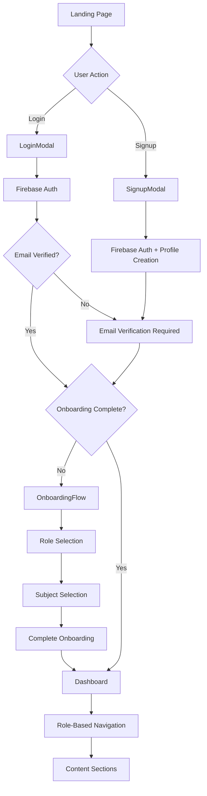

# PeerCodex - Functional Flow Documentation

## 📋 Overview

PeerCodex is a peer-to-peer mentoring platform designed for high school students to connect and collaborate on AP subjects and academic coursework. This document outlines the complete functional flow from landing page to post-authentication dashboard.

## 🏗️ Technical Stack

- **Frontend**: React 19.1.0 with Vite 7.0.4
- **Styling**: Tailwind CSS v4.1.11 with Vite plugin
- **Authentication**: Firebase 11.10.0 (Authentication + Firestore)
- **Routing**: React Router DOM
- **Notifications**: React Hot Toast
- **State Management**: React Context API

## 🌊 Complete User Flow

### 1. Landing Page Experience

**Entry Point**: `src/components/LandingPage.jsx`

#### Features:
- **Full-width responsive design** with gradient background
- **Modal-based authentication** (no page redirects)
- **Responsive navigation** with mobile hamburger menu
- **Multi-section layout**: Hero, Features, Stats, Footer

#### Key Components:
```jsx
// Modal state management
const [isLoginModalOpen, setIsLoginModalOpen] = useState(false);
const [isSignupModalOpen, setIsSignupModalOpen] = useState(false);

// Modal toggle functions
const openLoginModal = () => { /* switches between modals */ };
const openSignupModal = () => { /* switches between modals */ };
```

#### UI Elements:
- **Hero Section**: Responsive typography scaling from `text-4xl` to `text-9xl`
- **CTA Buttons**: "Join as a Student" and "Become a Mentor" (both open signup modal)
- **Features Section**: 3-column grid explaining the platform process
- **Stats Section**: Interactive stats with hover animations

---

### 2. Authentication System

#### 2.1 Signup Flow

**Component**: `src/components/SignupModal.jsx`

#### Form Fields:
- First Name (required)
- Last Name (required)
- Email (required, validated)
- Date of Birth (required)
- Password (required, min 6 characters)
- Confirm Password (required, must match)

#### Process Flow:
```jsx
// 1. Form validation
const validateForm = () => { /* client-side validation */ };

// 2. Firebase user creation
const userCredential = await createUserWithEmailAndPassword(auth, email, password);

// 3. Email verification
await sendEmailVerification(userCredential.user);

// 4. Firestore profile creation
await setDoc(doc(db, 'users', user.uid), {
  firstName, lastName, email, dateOfBirth,
  role: '', // Set during onboarding
  menteeSubjects: [],
  mentorSubjects: [],
  onboardingCompleted: false,
  emailVerified: false,
  createdAt: new Date()
});
```

#### 2.2 Login Flow

**Component**: `src/components/LoginModal.jsx`

#### Process Flow:
```jsx
// 1. Email/password authentication
const userCredential = await signInWithEmailAndPassword(auth, email, password);

// 2. Profile data fetch
const userDoc = await getDoc(doc(db, 'users', user.uid));

// 3. Route determination based on onboarding status
if (!userProfile.onboardingCompleted) {
  // Redirect to onboarding
} else {
  // Redirect to dashboard
}
```

---

### 3. Authentication Context & State Management

**File**: `src/hooks/useAuth.js` and `src/context/AuthContext.jsx`

#### Context State:
```jsx
const [currentUser, setCurrentUser] = useState(null);
const [userProfile, setUserProfile] = useState(null);
const [loading, setLoading] = useState(true);
```

#### Key Functions:
- `signup(userData)`: Creates user account and profile
- `login(email, password)`: Authenticates and fetches profile
- `logout()`: Signs out and clears state
- `setUserProfile(profile)`: Updates user profile in context

#### Firebase Listeners:
```jsx
// Auth state listener
useEffect(() => {
  const unsubscribe = onAuthStateChanged(auth, async (user) => {
    if (user) {
      // Fetch and set user profile
      const userDoc = await getDoc(doc(db, 'users', user.uid));
      setUserProfile(userDoc.data());
    } else {
      setUserProfile(null);
    }
    setCurrentUser(user);
    setLoading(false);
  });
  return unsubscribe;
}, []);
```

---

### 4. Protected Routes & Navigation

**File**: `src/components/ProtectedRoute.jsx`

#### Route Protection Logic:
```jsx
const ProtectedRoute = ({ children, requireEmailVerified = false, requireOnboarding = false }) => {
  // Redirect based on authentication state
  if (!currentUser) return <Navigate to="/" />;
  if (requireEmailVerified && !userProfile?.emailVerified) return <EmailVerificationPrompt />;
  if (requireOnboarding && !userProfile?.onboardingCompleted) return <Navigate to="/onboarding" />;
  
  return children;
};
```

#### Route Configuration in `src/App.jsx`:
```jsx
<Routes>
  <Route path="/" element={<LandingPage />} />
  <Route path="/onboarding" element={
    <ProtectedRoute requireEmailVerified={true}>
      <OnboardingFlow />
    </ProtectedRoute>
  } />
  <Route path="/dashboard" element={
    <ProtectedRoute requireEmailVerified={true} requireOnboarding={true}>
      <Dashboard />
    </ProtectedRoute>
  } />
  <Route path="/profile" element={
    <ProtectedRoute requireEmailVerified={true} requireOnboarding={true}>
      <Profile />
    </ProtectedRoute>
  } />
</Routes>
```

---

### 5. Onboarding Flow

#### 5.1 Onboarding Controller

**File**: `src/components/OnboardingFlow.jsx`

#### Multi-step Process:
```jsx
const [currentStep, setCurrentStep] = useState(1);
const [onboardingData, setOnboardingData] = useState({
  role: '',
  menteeSubjects: [],
  mentorSubjects: []
});

// Step navigation
const handleNext = (stepData) => {
  setOnboardingData(prev => ({ ...prev, ...stepData }));
  if (currentStep === 1) setCurrentStep(2);
  else if (currentStep === 2) completeOnboarding();
};
```

#### 5.2 Role Selection

**File**: `src/components/OnboardingWelcome.jsx`

#### Role Options:
- **Mentee**: Students seeking academic help
- **Mentor**: Students offering academic assistance  
- **Both**: Students who can both mentor and be mentored

```jsx
const roles = [
  { id: 'mentee', title: 'Mentee', description: 'I want to learn from others', icon: '📚' },
  { id: 'mentor', title: 'Mentor', description: 'I want to help others learn', icon: '🎓' },
  { id: 'both', title: 'Both', description: 'I want to learn and teach', icon: '🤝' }
];
```

#### 5.3 Subject Selection with Mutual Exclusion

**File**: `src/components/OnboardingSubjects.jsx`

#### AP Subjects Available:
```jsx
// Imported from constants file
import { AP_SUBJECTS } from '../constants';

// AP_SUBJECTS contains:
const AP_SUBJECTS = [
  'AP Biology', 'AP Chemistry', 'AP Physics 1', 'AP Physics 2', 'AP Physics C',
  'AP Calculus AB', 'AP Calculus BC', 'AP Statistics', 'AP Computer Science A',
  'AP Computer Science Principles', 'AP English Language', 'AP English Literature',
  'AP US History', 'AP World History', 'AP European History', 'AP Government',
  'AP Economics (Macro)', 'AP Economics (Micro)', 'AP Psychology', 'AP Sociology',
  'AP French', 'AP Spanish', 'AP German', 'AP Latin', 'AP Chinese',
  'AP Art History', 'AP Studio Art', 'AP Music Theory', 'AP Environmental Science',
  'AP Human Geography'
];
```

#### Mutual Exclusion Logic:
```jsx
const handleMenteeSubjectToggle = (subject) => {
  setMenteeSubjects(prev => {
    if (prev.includes(subject)) {
      return prev.filter(s => s !== subject); // Remove if already selected
    } else {
      // Add to mentee and remove from mentor if present
      setMentorSubjects(prevMentor => prevMentor.filter(s => s !== subject));
      return [...prev, subject];
    }
  });
};
```

#### Visual Feedback:
- **Selected subjects**: Colored borders and backgrounds
- **Disabled subjects**: Grayed out with explanatory text
- **Tooltips**: Explain why subjects are disabled

---

### 6. Profile Management

**File**: `src/components/Profile.jsx`

#### Features:
- **Edit Mode Toggle**: Switch between view and edit modes
- **Role Modification**: Change mentee/mentor/both status
- **Subject Management**: Add/remove subjects with mutual exclusion
- **Firebase Integration**: Real-time updates to Firestore

#### Edit Mode Logic:
```jsx
const [isEditing, setIsEditing] = useState(false);
const [editData, setEditData] = useState({
  role: userProfile?.role || '',
  menteeSubjects: userProfile?.menteeSubjects || [],
  mentorSubjects: userProfile?.mentorSubjects || []
});

const handleSave = async () => {
  await updateDoc(doc(db, 'users', userProfile.uid), {
    role: editData.role,
    menteeSubjects: editData.menteeSubjects,
    mentorSubjects: editData.mentorSubjects,
    updatedAt: new Date()
  });
  setUserProfile(prev => ({ ...prev, ...editData }));
};
```

---

### 7. Post-Authentication Dashboard

**File**: `src/components/Dashboard.jsx`

#### Layout Architecture:
1. **Collapsible Sidebar**: Navigation menu with role-based items
2. **Top Header**: Logo, user info, sign out button
3. **Main Content**: Scrollable area with dynamic content

#### Role-Based Navigation:
```jsx
const navigationItems = [
  { id: 'overview', label: 'Overview', icon: '📊', available: true },
  { id: 'profile', label: 'My Profile', icon: '👤', available: true },
  
  // Mentee Features (when user needs mentoring)
  ...(canAccessMentorFeatures ? [
    { id: 'mentor-search', label: 'Find Mentors', icon: '🔍', available: true },
    { id: 'mentor-requests-sent', label: 'Requests Sent', icon: '📤', available: true },
  ] : []),
  
  // Mentor Features (when user can mentor others)
  ...(canAccessMenteeFeatures ? [
    { id: 'mentor-requests-received', label: 'Mentor Requests', icon: '📥', available: true },
    { id: 'my-mentees', label: 'My Mentees', icon: '👥', available: true },
  ] : []),
  
  { id: 'sessions', label: 'Study Sessions', icon: '📚', available: true },
  { id: 'messages', label: 'Messages', icon: '💬', available: true },
  { id: 'settings', label: 'Settings', icon: '⚙️', available: true },
];
```

#### Dashboard Sections:

##### Overview Content:
- **Welcome Message**: Personalized greeting
- **Stats Cards**: Active sessions, connections, subjects
- **Profile Summary**: Key user information
- **Recent Activity**: Platform interactions

##### Role-Specific Features:
- **Find Mentors** (mentee/both): Search and browse mentors
- **Requests Sent** (mentee/both): Track outgoing mentor requests
- **Mentor Requests** (mentor/both): Review incoming requests
- **My Mentees** (mentor/both): Manage current mentoring relationships

---

### 8. Constants & Configuration

**File**: `src/constants/index.js`

#### Application Constants:
```jsx
// AP Subjects available for mentoring/learning
export const AP_SUBJECTS = [30 subjects array];

// User role definitions
export const USER_ROLES = {
  MENTEE: 'mentee',
  MENTOR: 'mentor', 
  BOTH: 'both'
};

// Role options for onboarding (simplified version)
export const ROLE_OPTIONS = [
  { id: 'mentee', title: 'Mentee', description: 'I want to learn from others', icon: '📚' },
  { id: 'mentor', title: 'Mentor', description: 'I want to help others learn', icon: '🎓' },
  { id: 'both', title: 'Both', description: 'I want to learn and teach', icon: '🤝' }
];
```

#### Benefits:
- **Single source of truth** for subject lists
- **Easy maintenance** when adding/removing subjects
- **Consistent data** across components
- **Type safety** with role constants

---

## 🗄️ Data Structure

### User Profile (Firestore Document):
```javascript
{
  uid: "firebase_user_id",
  firstName: "John",
  lastName: "Doe", 
  email: "john.doe@email.com",
  dateOfBirth: "2006-01-15",
  role: "both", // "mentee" | "mentor" | "both"
  menteeSubjects: ["AP Chemistry", "AP Calculus AB"],
  mentorSubjects: ["AP Biology", "AP Physics 1"],
  onboardingCompleted: true,
  emailVerified: true,
  createdAt: Timestamp,
  updatedAt: Timestamp
}
```

---

## 🔐 Security & Validation

### Client-Side Validation:
- **Email format validation**
- **Password strength requirements** (min 6 characters)
- **Password confirmation matching**
- **Required field validation**
- **Date of birth validation**

### Firebase Security Rules:
- **Authentication required** for all user data access
- **User can only access their own profile**
- **Email verification required** for sensitive operations

### Route Protection:
- **Public routes**: Landing page only
- **Email verification required**: Onboarding and dashboard
- **Onboarding completion required**: Dashboard access

---

## 🎨 Styling & Design System

### Tailwind CSS v4 Configuration:
- **Custom CSS imports** in `src/styles.css`
- **Responsive design**: Mobile-first approach
- **Color scheme**: Indigo/blue primary, gray neutrals
- **Typography**: Responsive scaling system
- **Animation**: Smooth transitions and hover effects

### Design Patterns:
- **Modal-based authentication**: No page redirections
- **Full-width layouts**: Maximized screen usage
- **Card-based content**: Consistent visual hierarchy
- **Role-based UI**: Conditional component rendering

---

## 🔄 State Management Flow



---

## 📱 Responsive Design Breakpoints

### Navigation:
- **Desktop**: Horizontal navigation bar
- **Mobile**: Hamburger menu with slide-down

### Typography Scaling:
- **Small screens**: `text-4xl` (hero text)
- **Large screens**: `text-9xl` (hero text)
- **Responsive padding**: Scales with screen size

### Layout Adaptations:
- **Sidebar**: Collapses to icons on mobile
- **Grid layouts**: Responsive column counts
- **Button layouts**: Stack vertically on mobile

---

## 🚀 Future Implementation Areas

### Immediate Enhancements:
1. **Mentor Search**: Browse and filter available mentors
2. **Request System**: Send/receive mentoring requests
3. **Messaging**: Real-time communication
4. **Session Scheduling**: Calendar integration
5. **User Matching**: Algorithm-based mentor suggestions

### Advanced Features:
1. **Video Calling**: Integrated study sessions
2. **File Sharing**: Academic resources
3. **Progress Tracking**: Learning analytics
4. **Ratings & Reviews**: Mentor feedback system
5. **Group Sessions**: Multi-user study rooms

---

## 📂 File Structure Reference

```
src/
├── components/
│   ├── LandingPage.jsx           # Main landing page
│   ├── LoginModal.jsx            # Login form modal
│   ├── SignupModal.jsx           # Signup form modal
│   ├── Dashboard.jsx             # Post-auth dashboard
│   ├── Profile.jsx               # Profile management
│   ├── ProtectedRoute.jsx        # Route protection
│   ├── OnboardingFlow.jsx        # Onboarding controller
│   ├── OnboardingWelcome.jsx     # Role selection
│   └── OnboardingSubjects.jsx    # Subject selection
├── constants/
│   └── index.js                  # App constants (subjects, roles)
├── hooks/
│   └── useAuth.js                # Authentication hook
├── context/
│   └── AuthContext.jsx           # Global auth state
├── firebase.js                   # Firebase configuration
├── App.jsx                       # Route configuration
└── styles.css                    # Tailwind imports
```

---

## 🎯 Key Success Metrics

### User Experience:
- **Seamless authentication flow** with modal-based UI
- **Intuitive onboarding** with clear role definitions
- **Responsive design** across all device sizes
- **Fast navigation** with collapsible sidebar

### Technical Achievements:
- **Real-time data sync** with Firebase Firestore
- **Secure authentication** with email verification
- **Scalable component architecture** with React hooks
- **Modern styling** with Tailwind CSS v4

### Business Logic:
- **Role-based access control** for mentors/mentees
- **Subject mutual exclusion** prevents conflicts
- **Onboarding completion tracking** ensures data quality
- **Profile management** allows user customization

---

*This document represents the current state of PeerCodex functional flow as of the implementation. All code references are accurate and reflect the actual codebase structure.*
